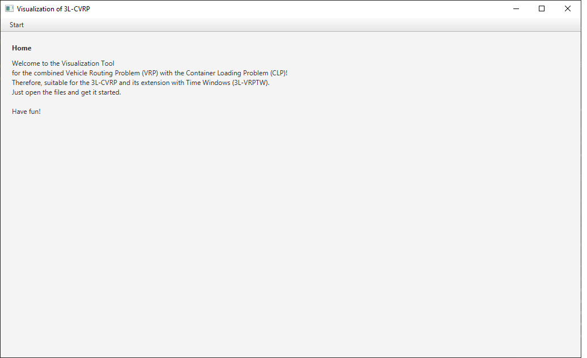
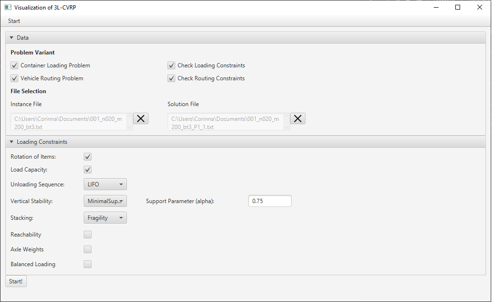
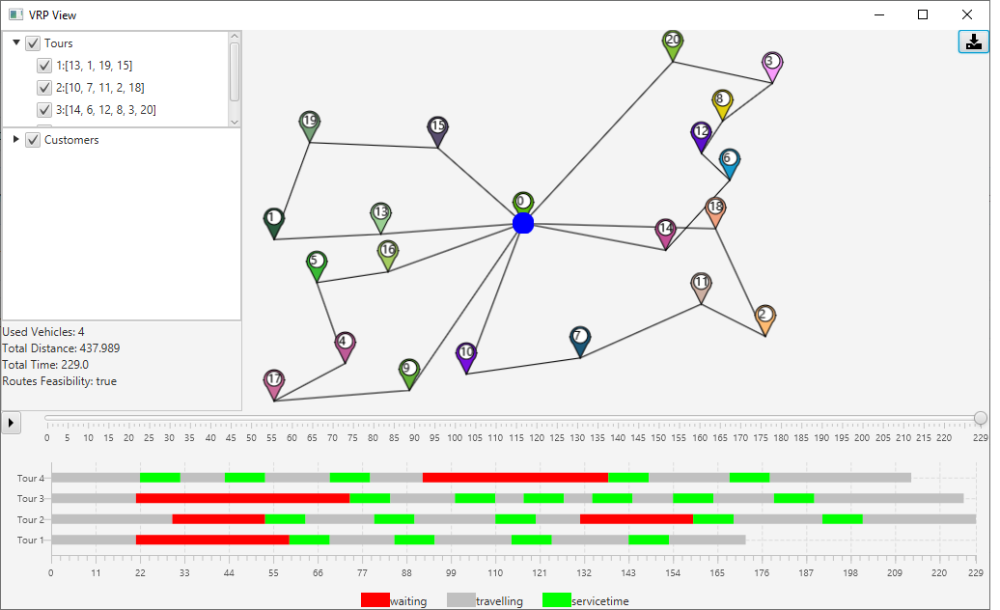
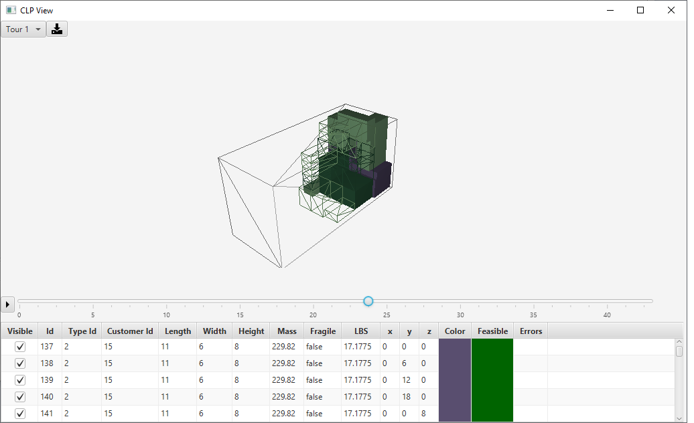

# Visualizer
This tool visualizes solutions for the Vehicle Routing Problem combined with the 3D Container Loading Problem.

## CI Status

## License

## Creators
Corinna Krebs

## Introduction
The optimization of cargo loading and transportation of goods are two highly considered NP-hard optimization problems. The combination
of both, namely the 3L-CVRP, has attracted increasingly interest in the past decades. Hereby, three-dimensional cuboid items have to be
transported from a central depot to a given set of customers using a homogeneous fleet of vehicles. Each route must be provided with a
feasible packing plan taking various constraints into account. In one extension, time windows at the depot and at customers are additionally
considered (3L-VRPTW). 

This tool visualizes solutions for the 3L-CVRP and has therefore two views: in the vehicle routing view, the tour plan and the corresponding schedule are displayed. In the
packing plan view, the position of each item in the cargo space is visualized. It is also possible to use the tool solely for one optimization problem (e.g. vehicle routing or 3D container loading problem).

Moreover, the tool checks the feasibility of the solutions and indicates violated constraints by using an integration with the [soludion validator](https://github.com/CorinnaKrebs/SolutionValidator). 

## Requirements
* min. Java 11
* Software: Java JRE, JavaFX, [Apache Maven Version 2.0](https://maven.apache.org/), IDE (e.g. [IntelliJ](https://www.jetbrains.com/de-de/idea/) or [Eclipse](https://www.eclipse.org/downloads/)), Lombok
* Build files: [pom.xml](https://github.com/CorinnaKrebs/Visualizer/blob/master/pom.xml)

## Data
* Please check [Soludion Validator](https://github.com/CorinnaKrebs/SolutionValidator) for necessary input files

## Link to Live-Demo
_Coming soon_

## Usage
1) When starting the application, a welcome window appears.

2) Click in the menu -> open.
   Then Drag&Drop or select the instance and the solution file (see [files](https://github.com/CorinnaKrebs/Visualizer/blob/master/example))
   Then, press on "Start!"
   

3) The CLP (in the back) and the VRP (in the front) window appear.

Have fun!

